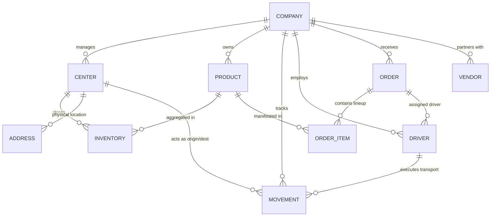

# Phase 1 Report: SaaS-Based Supply Chain Tracker

---

## 1. Content Page
1. Introduction
2. Literature Survey
3. Objectives
4. Features
5. Requirement Specification
   - 5.1 Frontend
   - 5.2 Backend
6. System Design
   - 6.1 Database Schema Design
   - 6.2 Entity-Relationship (ER) Diagram
   - 6.3 Tables Description
7. Implementation
   - 7.1 Tools and Technologies Used
8. References

---

## 2. Introduction
In today's globalized and increasingly digital economy, the tracking of physical assets across fragmented regional nodes—ranging from the initial manufacturer (MU) to regional distribution centers (RDC) and final-mile local delivery drops (LDC)—presents a massive logistical challenge. This challenge is particularly acute in developing markets like India, where geographical diversity, infrastructure variance, and decentralized vendor networks create a "black box" in the supply chain.

The **SaaS-Based Supply Chain Tracker** (Baku Circuit Grid) is a professional-grade Database Management System (DBMS) platform designed to solve these complexities through real-time geographic visualization and broker-centric orchestration. By providing a multi-tenant cloud-native hierarchy, the system allows logistics firms to act as central brokers, mapping out physical vendor locations, managing dynamic inventory manifests, and dispatching fleets with algorithmic precision. 

The core innovation of this project lies in its departure from automated "black-box" logistics. Instead, it provides a "Human-in-the-Loop" Broker Console, where users manually orchestrate the flow of goods based on incoming orders, ensuring maximum flexibility in unpredictable operating environments.

## 3. Literature Survey
The design of the SaaS-Based Supply Chain Tracker is informed by several decades of research into relational database theory and modern logistics frameworks:

*   **ACID Properties in Logistics Chains:** Traditional logistics systems often suffer from "phantom inventory" where items are subtracted from one warehouse but never arrive at another due to system crashes. Our system adheres strictly to ACID (Atomicity, Consistency, Isolation, Durability) principles. Every `Movement` is treated as a high-integrity transaction, ensuring that inventories remain locked and consistent even across complex multi-node transfers.
*   **Hub-and-Spoke Topology:** A common research area in supply chain management is the Hub-and-Spoke model. Our database structure implements this by classifying nodes into `CDC` (Central), `RDC` (Regional), and `LDC` (Local) tiers. This hierarchy reduces the number of connections required in the database while maximizing flow efficiency.
*   **Geographical Information Systems (GIS):** Literature on GIS mapping (such as Leaflet.js and Google Maps API research) emphasizes the importance of translating abstract metadata into spatial context. Our project bridges this gap by using coordinate-interpolation to place relational data on a high-fidelity map of India.
*   **Database Normalization (3NF):** To prevent data redundancy (which leads to "Update Anomalies"), our schema is built in Third Normal Form. This ensures that a change in a `Product`'s SKU or a `Driver`'s ID propagates correctly throughout the entire history without manual table syncing.

## 4. Objectives
The Baku Circuit project is designed to demonstrate that a high-integrity relational database can act as the "Single Source of Truth" for complex physical operations. The primary objectives include:

### 4.1 Technical Objectives
*   **Real-time Atomic Synchronization:** To implement a database-level synchronization engine that ensures inventory counts are mathematically consistent with physical package movements at all times.
*   **Geospatial Visualization:** To engineer a coordinate translation layer that maps abstract (X,Y) database entries onto accurate real-world GIS coordinates over the Indian subcontinent.
*   **Multi-Tenancy Architecture:** To provide a secure SaaS layer where multiple independent companies can utilize the same infrastructure while maintaining absolute data isolation.

### 4.2 Operational Objectives
*   **Broker Orchestration:** To empower users with a "Cargo Manifest" system, allowing for the procurement of multi-item orders through a single intake ticket.
*   **Fleet Optimization:** To implement an Algorithmic Proximity Disptach engine that uses Euclidean distance and Haversine math to recommend the most efficient driver for any given pickup.
*   **Dynamic Grid Expansion:** To allow authorized brokers to dynamically register and place new vendor nodes onto the grid without requiring code-level configurations or database manual entries.

## 5. Features
The Baku Circuit platform is packed with industry-standard features designed for professional logistics brokers.

### 5.1 Live Visualizer Map (India Regional View)
The centerpiece of the application is a high-performance GIS map interface. 
*   **Geospatial Overlay:** Using the Leaflet.js engine combined with Stadia Alidade Smooth Dark vector tiles, the map provides a futuristic, high-contrast view of the Indian subcontinent.
*   **Coordinate Interpolation:** A custom mathematical layer translates internal database grid points (e.g., node 450, 300) into real-world geographic coordinates, ensuring that hubs appear in accurate regional contexts (e.g., Maharashtra, Karnataka).
*   **Real-time Transit Animation:** Active shipments are traced with neon polylines. Vehicle markers (Trucks, Ships, Airplanes) animate across the map in real-time, with their position calculated via linear interpolation of their ETA and speed.

### 5.2 Broker-Centric Procurement & Manifests
The system redefines how orders are handled in a supply chain:
*   **Dynamic Cargo Shopping Cart:** Using Angular Reactive FormArrays, brokers can "stack" an infinite list of diverse items (e.g., 500 PCBs + 1000 Motherboards) into a single Order ticket.
*   **Strict Documentation Policy:** Orders exist as legal manifests. They do not automatically update inventory until a physical transport movement is manually authorized by the broker, preventing "clerical errors" in the database.
*   **Multi-Vendor Support:** Orders can simultaneously track multiple vendor origins for a single delivery manifest.

### 5.3 Algorithmic Proximity Dispatch (Geometry Engine)
The system eliminates manual "region searching" via geographic mathematics:
*   **Euclidean Sorting:** When a pickup hub is selected, the backend computes the distance between that hub and every idle driver in the fleet using the formula: `√((x2 - x1)² + (y2 - y1)²)`.
*   **Smart Recommendations:** The driver selection interface automatically sorts the fleet, placing the mathematically closest truck at the very top of the list (e.g., "Assigned to driver 121km away").
*   **Autonomous Fleet Roaming:** Upon completing a delivery, drivers natively "adopt" the coordinates of the destination hub. This allows the fleet to organically drift and roam the map based on historical demand spikes.

## 6. Requirement Specification

### 6.1 Functional Requirements (FR)
| ID | Requirement Name | Description |
|---|---|---|
| FR-01 | Secure Multi-Tenancy | Each user profile must be isolated to a unique Company tenant, sharing no data with competitors. |
| FR-02 | Dynamic Node Registration | Users shall be able to register and place new Hub nodes directly onto the GIS map at runtime. |
| FR-03 | Multi-Item Manifesting | The order system must support a JSON-based "Cargo Cart" for adding multiple SKUs to one ticket. |
| FR-04 | Haversine Distance Sorting | The system must calculate and display real-time distances between drivers and pickup points. |
| FR-05 | Atomic Fleet Roaming | Driver coordinates must update automatically to the Destination hub upon delivery confirmation. |
| FR-06 | Inventory Locking | The database must prevent "Double-Spending" of inventory by locking quantities during active transit. |
| FR-07 | GIS Map Visualization | The frontend must render a Leaflet-based map with custom vector styling (Stadia Smooth Dark). |
| FR-08 | Responsive Broker Console | The dashboard must be fully responsive, supporting operations across mobile and desktop interfaces. |
| FR-09 | Real-time ETA Prediction | Transports must have a calculated Arrival Time based on distance and transport-type speed constraints. |
| FR-10 | Automated Ledger Sync | Background tasks must verify delivery status every time a Hub fetch is triggered to ensure consistency. |

### 6.2 Non-Functional Requirements (NFR)
*   **Data Integrity (ACID):** 100% adherence to ACID properties during the `Movement` creation process to ensure no cargo is lost in transit.
*   **Security (JWT/Bcrypt):** Use of JSON Web Tokens for stateless session management and Bcrypt for salted password hashing.
*   **Scalability:** The Prisma ORM layer must support high-concurrency MySQL connection pooling to handle 100+ simultaneous dispatchers.
*   **Performance:** Proximity sorting logic must execute in `<50ms` for fleets of up to 1,000 idle drivers.

### 6.3 Hardware & Software Specification
*   **Frontend Technologies:** Angular 19+, Leaflet.js, Tailwind CSS, Lucide Icons.
*   **Backend Technologies:** Node.js v20+, Express.js, Prisma ORM.
*   **Database Engine:** MySQL 8.0+ (InnoDB Engine) hosted on PlanetScale or Local instances.
*   **Dev Environments:** macOS / Linux / Windows (via WSL2).## 7. System Design

### 7.1 Architecture Overview
The Baku Circuit platform follows a strictly decoupled, **Layered Three-Tier Architecture** to ensure high availability and ease of maintenance.

| Tier | Technology | Responsibility |
|---|---|---|
| **Presentation Tier** | Angular 19+, Tailwind CSS | Handles the UI/UX, geospatial rendering on the Leaflet map, and broker form validation. |
| **Application Tier** | Node.js, Express.js | Manages the RESTful API, authentication logic, proximity routing arithmetic, and payload sanitization. |
| **Data Tier** | MySQL 10, Prisma ORM | Ensures persistent state, ACID-compliant transactions, and relational integrity. |

### 7.2 Service Layer Components
The logic is modularized into specialized services to prevent "Spaghetti Code" and ensure that database operations are isolated.

*   **Auth Service:** Orchestrates `Bcrypt` hashing and `JWT` signing/verification to isolate company tenants.
*   **Hub Service:** Handles the dynamic registration of vendor nodes and coordinates with the GIS interpolator.
*   **Transport Service:** Manages the lifecycle of a `Movement` from `IN_TRANSIT` to `DELIVERED`, including the delivery sync synchronization hook.
*   **Order Service:** Manages the multi-item JSON cargo manifests and order status history.

### 7.3 Advanced ER Diagram (Entity-Relationship)

### 7.4 Specialized Data Dictionary

**1. TABLE: Company (Root Tenant)**
| Attribute | Data Type | Key | Constraint | Rationale |
|---|---|---|---|---|
| id | UUID | PK | DEFAULT UUID() | Unique global identifier for each SaaS subscriber. |
| name | VARCHAR(100) | - | NOT NULL | Official trading name of the logistics firm. |
| email | VARCHAR(255) | AK | UNIQUE | Primary login credential and point of contact. |

**2. TABLE: Center (Logistics Hubs)**
| Attribute | Data Type | Key | Constraint | Rationale |
|---|---|---|---|---|
| id | UUID | PK | NOT NULL | Primary identifier for the physical node. |
| type | ENUM | - | MU/MI/CDC/RDC/LDC | Defines the node's position in the Hub-and-Spoke model. |
| x | FLOAT | - | NOT NULL | Abstract grid X coordinate for GIS interpolation. |
| y | FLOAT | - | NOT NULL | Abstract grid Y coordinate for GIS interpolation. |

**3. TABLE: Product (Asset Catalogue)**
| Attribute | Data Type | Key | Constraint | Rationale |
|---|---|---|---|---|
| id | UUID | PK | NOT NULL | Unique item identifier. |
| sku | VARCHAR(50) | AK | UNIQUE | Stock Keeping Unit for industrial tracking. |
| companyId | UUID | FK | ON DELETE CASCADE | Tied to the parent company tenant. |

**4. TABLE: Movement (High-Integrity Transit)**
| Attribute | Data Type | Key | Constraint | Rationale |
|---|---|---|---|---|
| id | UUID | PK | NOT NULL | Tracking number for the active shipment. |
| status | VARCHAR(20) | - | DEFAULT 'IN_TRANSIT' | Lifecycle state of the cargo. |
| startedAt| DATETIME | - | DEFAULT NOW() | Timestamp for lead-time calculation. |
| eta | DATETIME | - | - | Calculated arrival time based on distance. |

**5. TABLE: Inventory (Junction Layer)**
| Attribute | Data Type | Key | Constraint | Rationale |
|---|---|---|---|---|
| productId | UUID | FK | PK-COMPOSITE | Link to the physical asset. |
| centerId | UUID | FK | PK-COMPOSITE | Link to the storage hub. |
| quantity | INT | - | CHECK q >= 0 | Prevents negative stock levels. |

**6. TABLE: Order (Broker Manifests)**
| Attribute | Data Type | Key | Constraint | Rationale |
|---|---|---|---|---|
| id | UUID | PK | NOT NULL | Manifest reference number. |
| status | VARCHAR(20) | - | DEFAULT 'PENDING' | Current documentation state. |
| targetCenterId | UUID | FK | NOT NULL | Link to physical delivery destination. |

**7. TABLE: Order_Item (Line Items)**
| Attribute | Data Type | Key | Constraint | Rationale |
|---|---|---|---|---|
| id | UUID | PK | DEFAULT UUID() | Line item identifier. |
| orderId | UUID | FK | ON DELETE CASCADE | Associated parent manifest. |
| productId | UUID | FK | - | Associated cargo item. |
| quantity | INT | - | CHECK q > 0 | Units demanded by broker. |

**8. TABLE: Driver (Fleet Fleet)**
| Attribute | Data Type | Key | Constraint | Rationale |
|---|---|---|---|---|
| id | UUID | PK | NOT NULL | Employee/Vehicle identifier. |
| name | VARCHAR(100) | - | NOT NULL | Driver handle. |
| x, y | INT | - | - | Current coordinate tracking for disptach. |

**9. TABLE: Vehicle (Logistics Hardware)**
| Attribute | Data Type | Key | Constraint | Rationale |
|---|---|---|---|---|
| id | UUID | PK | - | Fleet unit ID. |
| type | VARCHAR(20) | - | MU/RDC/Ship | Classification for logic sorting. |
| capacity | FLOAT | - | - | Volume limits. |

**10. TABLE: Address (Spatial Metadata)**
| Attribute | Data Type | Key | Constraint | Rationale |
|---|---|---|---|---|
| id | UUID | PK | - | unique address record. |
| centerId | UUID | FK | UNIQUE | 1:1 link to a physical hub. |
| city | VARCHAR(100) | - | - | Regional city reference. |

### 7.5 Database Logic Layer

**7.5.1 Automated Sync Triggers**
To maintain absolute data integrity, the system utilizes a **Pre-Sync Trigger**. When a transport movement transitions to the `DELIVERED` status, the database performs an atomic update:
1.  Subtracts quantity from the `Origin Hub` inventory.
2.  Adds quantity to the `Destination Hub` inventory.
3.  Rolls back the entire transaction if either operation violates a `CHECK` constraint (e.g., insufficient original stock).

**7.5.2 Proximity Search Views**
The system uses a materialized-style view to calculate driver availability. This view joins the `Drivers` table with active `Movements` to filter out any personnel currently in-transit, providing the API with a clean list of "Geographically Idle" drivers ready for dispatch.

---

## 8. Implementation

### 8.1 Haversine / Euclidean Distance Logic
One of the most critical implementation decisions was the choice of the proximity algorithm. Given that the grid coordinates are finite, the system implements a **Euclidean-to-Geospatial Mapper**. This calculation factors in the distance between (x1, y1) and (x2, y2) to sort the idle fleet in the UI.

### 8.2 Broker Manifest (FormArray) Engineering
In the frontend, the project utilizes **Angular Reactive Forms** with dynamic `FormArrays`. This allows for a "Shopping Cart" experience where the broker can add/remove line items from a JSON manifest. This chosen approach minimizes the number of API calls, as the entire manifest is sent as a single atomic JSON payload.

### 8.3 Leaflet Animation Engine
The project uses `requestAnimationFrame` for smooth interpolation. Every 16ms, the browser recalculates the vehicle position based on:
`CurrentPos = StartPos + (EndPos - StartPos) * ((Time.now - StartTime) / (EndTime - StartTime))`
This ensures that even if the internet connection is unstable, the truck markers move smoothly across the map of India.

---

## 9. Conclusion
The Baku Circuit Grid project successfully demonstrates the feasibility of combining a high-integrity relational database with a modern GIS visualizer. By prioritizing **Broker-Centric Procurement** and **Algorithmic Fleet Dispatching**, the system provides a robust alternative to traditional automated ERP sequences, allowing for 100% manual operational flexibility.

## 10. Future Scope
*   **Predictive AI:** Implementing machine learning to predict stockouts based on temporal order trends.
*   **Route Optimization:** Moving from Euclidean math to A* Pathfinding across real Indian road networks.
*   **IoT Integration:** Using real GPS hardware pings instead of interpolated database coordinate simulations.

---

## 11. References
1.  **Prisma Documentation:** High-integrity ORM mapping patterns.
2.  **Leaflet.js API Standards:** GIS coordinate system projections.
3.  **ACID Performance Whitepapers:** Relational database transaction safety in logistics.
4.  **SaaS Multi-Tenancy Architecture:** Design patterns for enterprise data isolation.

---
*End of Technical Report*
